# Line follower: how it runs

A map of everything that happens from the Run button to the motors, with links
to the code. Diagrams are Mermaid: they render on GitHub and in VS Code with a
Mermaid preview extension.

Line numbers were taken on 2026-09-28 (commit `6d54af0`). If the code moves,
search for the function name.

- [1. Two templates, one program](#1-two-templates-one-program)
- [2. From Run to a moving robot](#2-from-run-to-a-moving-robot)
- [3. The hub: main() and the 10 ms loop](#3-the-hub-main-and-the-10-ms-loop)
- [4. control_step(): one decision per loop](#4-control_step-one-decision-per-loop)
- [5. Reflection bands](#5-reflection-bands)
- [6. Steering maths](#6-steering-maths)
- [7. Which edge the robot follows](#7-which-edge-the-robot-follows)
- [8. track_route(): route steps L, R, S](#8-track_route-route-steps-l-r-s)
- [9. The S step across a crossing](#9-the-s-step-across-a-crossing)
- [10. Line search](#10-line-search)
- [11. Wall fallback](#11-wall-fallback)
- [12. The laptop while the robot drives](#12-the-laptop-while-the-robot-drives)
- [13. Walkthrough: route LRS with KP > 0](#13-walkthrough-route-lrs-with-kp--0)
- [14. Constants](#14-constants)

---

## 1. Two templates, one program

The hub runs one MicroPython file. It is built from two Jinja2 templates:

| File | Owns | Used by |
|---|---|---|
| [`_base.py.j2`](../app/codegen/templates/_base.py.j2) | devices, odometry, telemetry, command poll, **watchdog**, `main()`, `run_loop()` | every mode |
| [`line_follower.py.j2`](../app/codegen/templates/line_follower.py.j2) | `setup()` and `control_step()` plus their helpers | line follower only |

`line_follower.py.j2` starts with `` and fills the
single `` hole in the base
([`_base.py.j2:326`](../app/codegen/templates/_base.py.j2#L326)). The other
modes (`teleop`, `drift_test`, `calibrate`) fill the same hole, so all four
share one loop, one protocol and one watchdog.

Why the split:

- **Safety.** CLAUDE.md requires a watchdog in every hub program. It lives once,
  in the base; a mode cannot ship without it and cannot redefine it.
- **One protocol.** `T`/`D`/`S`/`E` lines and the command parser are written
  once, so every mode speaks exactly what `app/core/protocol.py` decodes.
- **Small modes.** A mode only answers "what do I do this 10 ms?".

Why Jinja:

- **The hub cannot read the app's config.** Ports, motor directions,
  calibration, geometry, starting tuning values, the route and the sound switch
  are written into the program text (`{{ tuning.kp }}`, `{{ left.port }}`, ...).
- **Only the devices that exist.** `` removes the ultrasonic
  code when no sensor is assigned; creating a device on an empty port raises
  `OSError` on the hub, and unused code costs RAM.
- **Errors show up on the laptop.** The environment uses `StrictUndefined`
  ([`generator.py:67`](../app/codegen/generator.py#L67)): a missing value fails
  at render time with a message in the UI, not as a crash on the robot.
- **One readable file.** The result, `build/hub_line_follower.py`, is complete
  and self-contained. It is what Ctrl+U shows, and hub traceback line numbers
  point into it.

Live changes (sliders) do not need a new render: they travel as commands
(`KP,1.5`) while the program runs. Jinja only sets the starting values.

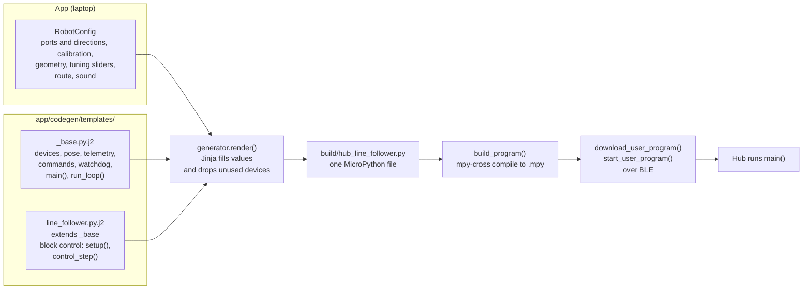

Code: [`generate()`](../app/codegen/generator.py#L132),
[`render()`](../app/codegen/generator.py#L78),
[`build_program()`](../app/core/connection.py#L101),
[`run_file()`](../app/core/connection.py#L238).

---

## 2. From Run to a moving robot

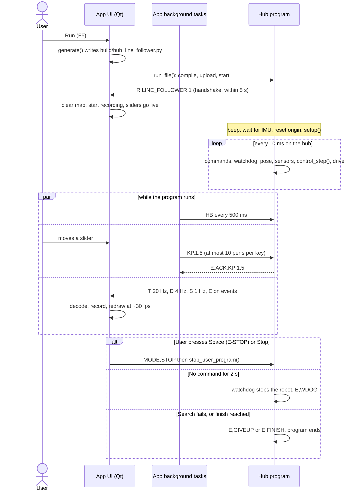

Code: [`run_program()`](../app/ui/main_window.py#L636),
[`_handle_record()`](../app/ui/main_window.py#L1063) (the `Ready` branch),
[`stop_program()`](../app/ui/main_window.py#L678).

---

## 3. The hub: main() and the 10 ms loop

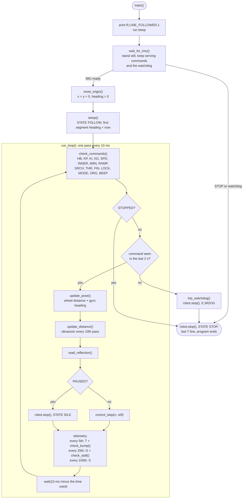

Code: [`main()`](../app/codegen/templates/_base.py.j2#L332),
[`run_loop()`](../app/codegen/templates/_base.py.j2#L349),
[`check_commands()`](../app/codegen/templates/_base.py.j2#L228),
[`watchdog_ok()`](../app/codegen/templates/_base.py.j2#L293),
[`update_pose()`](../app/codegen/templates/_base.py.j2#L109).

Tuning commands are answered with `E,ACK,KEY:value`. A malformed value is
ignored: no ACK, the old value stays, the robot keeps driving.

---

## 4. control_step(): one decision per loop

Everything the line follower decides happens here, top to bottom, once per
10 ms. Each early `return` ends the pass; `run_loop()` then sends telemetry
and waits for the next one.

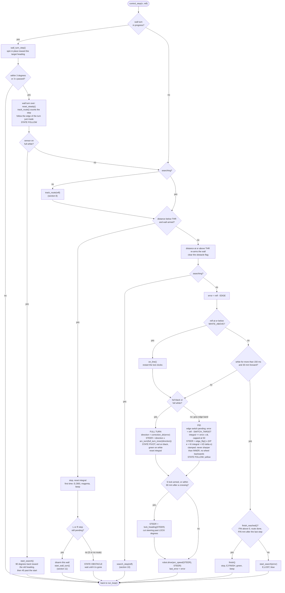

| Block | Lines |
|---|---|
| Wall turn in progress | [`458-472`](../app/codegen/templates/line_follower.py.j2#L458) |
| Route tracking | [`473-474`](../app/codegen/templates/line_follower.py.j2#L473) |
| Obstacle and wall fallback | [`476-498`](../app/codegen/templates/line_follower.py.j2#L476) (only rendered when a distance sensor is assigned) |
| Search | [`500-502`](../app/codegen/templates/line_follower.py.j2#L500) |
| Lost line and finish | [`504-512`](../app/codegen/templates/line_follower.py.j2#L504) |
| Full turn | [`514-521`](../app/codegen/templates/line_follower.py.j2#L514) |
| PID | [`522-531`](../app/codegen/templates/line_follower.py.j2#L522) |
| S lock | [`532-533`](../app/codegen/templates/line_follower.py.j2#L532) |
| Drive | [`534-535`](../app/codegen/templates/line_follower.py.j2#L534) |

The lost rule needs **both** time and distance: after a full turn the robot
sits on white next to the line while it swings back, which takes time but
barely moves it forward. Running off the line moves it forward.

---

## 5. Reflection bands

Computed from the calibration at
[`44-48`](../app/codegen/templates/line_follower.py.j2#L44). Example: black 3,
white 100.

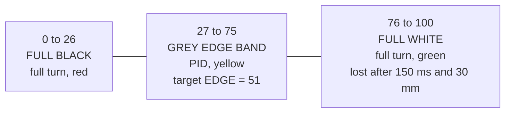

| Name | Formula | Example |
|---|---|---|
| `EDGE` | (BLACK + WHITE) / 2 | 51 |
| `BLACK_BELOW` | (BLACK + EDGE) // 2 | 27 |
| `WHITE_ABOVE` | (WHITE + EDGE) // 2 | 75 |
| `SWITCH_TARGET` | BLACK_BELOW - 2 | 25 |

`error = refl - EDGE`: negative is too far onto the tape, positive is too far
onto the mat.

---

## 6. Steering maths

The outer wheel always runs at SPD; only the inner wheel slows. Steering is a
turn rate in deg/s (positive turns right).

| Function | Formula | Meaning |
|---|---|---|
| [`arc_turn(inner)`](../app/codegen/templates/line_follower.py.j2#L265) | SPD x (1 - inner) / axle, in deg/s | turn rate when the inner wheel runs at `inner` x SPD (1 = straight, 0 = stopped, below 0 = backwards) |
| [`arc_speed(turn)`](../app/codegen/templates/line_follower.py.j2#L271) | SPD - turn x axle / 2 | centre speed that keeps the outer wheel at SPD |
| [`swing_speed(turn)`](../app/codegen/templates/line_follower.py.j2#L277) | turn x axle / 2 | centre speed that pivots on a stopped inner wheel (search) |
| [`full_turn_inner(dir)`](../app/codegen/templates/line_follower.py.j2#L250) | INNER to IMIN over RAMP ms | the adaptive full turn |

Adaptive full turn:

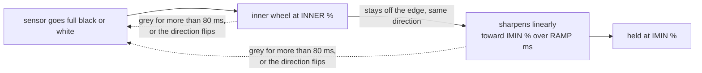

A 90 degree corner is done before the turn sharpens much; a hairpin keeps
the sensor off the edge and gets the sharp turn.

PID output is clamped to `arc_turn(max(0, INNER) / 100)`
([`528`](../app/codegen/templates/line_follower.py.j2#L528)): never sharper
than the full turn and never with a wheel running backwards.

---

## 7. Which edge the robot follows

The robot follows one edge of the tape. **KP > 0 follows the left edge,
KP < 0 the right edge.** An edge follower takes its own side's branch at a
junction, which is how the route picks branches without a second sensor.

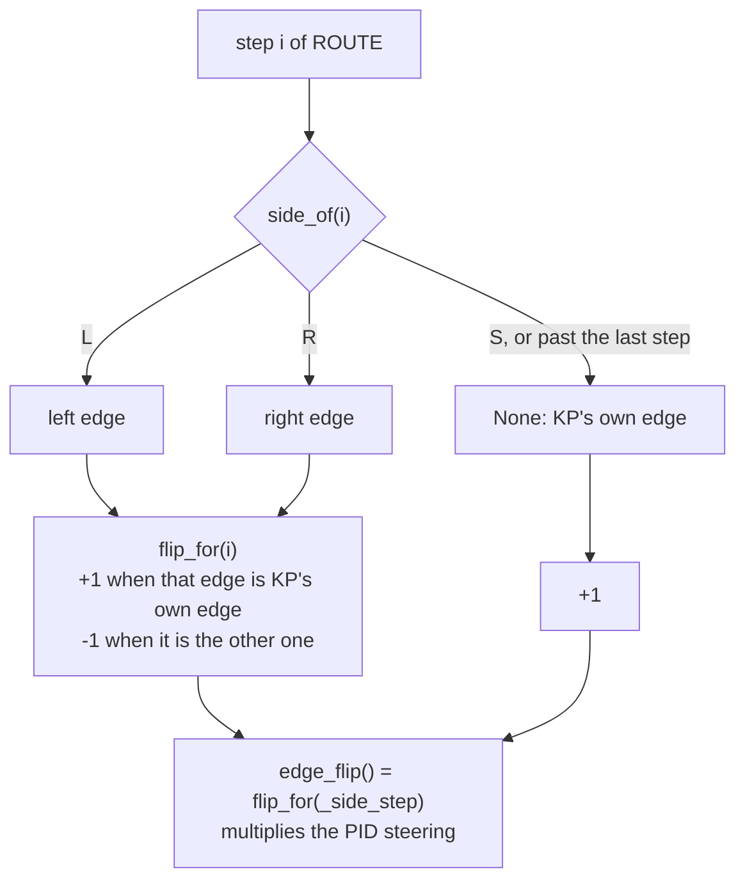

| KP sign | L step | R step | S step, after the route |
|---|---|---|---|
| KP > 0 (left edge) | +1 (left) | -1 (right) | +1 (left) |
| KP < 0 (right edge) | -1 (left) | +1 (right) | +1 (right) |

`_side_step` is the step whose edge is in use now. It trails `_step` until the
edge switch for the next step is done (section 8).

[`correction_dir(error)`](../app/codegen/templates/line_follower.py.j2#L282)
gives the direction of a full turn back to the edge, using the same KP sign
and `edge_flip()`, so full turns and PID always agree on the side.

Code: [`side_of()`](../app/codegen/templates/line_follower.py.j2#L170),
[`flip_for()`](../app/codegen/templates/line_follower.py.j2#L181),
[`edge_flip()`](../app/codegen/templates/line_follower.py.j2#L191).

---

## 8. track_route(): route steps L, R, S

Runs every pass unless a search is running
([`321`](../app/codegen/templates/line_follower.py.j2#L321)). Heading is in
the app frame: CCW-positive, so a right turn lowers it.

```mermaid
flowchart TD
    A(["track_route(refl)"]) --> T{"500 ms since<br/>the last steady test?"}
    T -->|"yes"| T1["steady = net heading change below 5 degrees<br/>remember the heading"] --> N
    T -->|"no"| N["near = heading within 30 degrees<br/>of the segment heading"]

    N --> AN{"near, steady and<br/>edge switch done?"}
    AN -->|"yes"| AN1["learn the real line heading:<br/>move the segment heading 1% toward the heading,<br/>kept within 15 degrees of the step's first guess"] --> SF
    AN -->|"no"| SF

    SF{"S next, not forced,<br/>edge switch not done?"}
    SF -->|"yes"| SF1{"120 mm or more<br/>since the last step?"}
    SF1 -->|"yes"| SF2["forced: drop the switch,<br/>arm the S lock on the current edge"] --> SW
    SF1 -->|"no"| SW
    SF -->|"no"| SW

    SW{"edge switch pending<br/>and not forced?"}
    SW -->|"no"| DN
    SW -->|"yes"| SA{"same physical edge?"}
    SA -->|"yes"| SA1["nothing to cross: switch done"] --> DN
    SA -->|"no"| RD{"near and steady?"}
    RD -->|"yes"| RD1["switch ready:<br/>PID aims at SWITCH_TARGET,<br/>the sensor walks into the tape"] --> BK
    RD -->|"no"| BK{"switch ready<br/>and full black?"}
    BK -->|"yes"| BK1["switch done: the new edge takes over<br/>and carries the sensor across the tape"] --> DN
    BK -->|"no"| DN

    DN{"route finished?"}
    DN -->|"yes"| RET(["return"])
    DN -->|"no"| K{"next step"}
    K -->|"S"| S1["mark the tape left after the switch<br/>mark settled when near and steady"]
    S1 --> S2{"straight_armed()?"}
    S2 -->|"yes"| S3["track_straight(refl)<br/>(section 9)"] --> RET
    S2 -->|"no"| RET
    K -->|"L or R"| C{"turned 60 degrees that way<br/>from the segment heading?"}
    C -->|"yes"| C1["segment heading -/+ 90 degrees: the next first guess<br/>step_taken(): E,TURN n/N"] --> RET
    C -->|"no"| RET
```

[`step_taken()`](../app/codegen/templates/line_follower.py.j2#L221) advances
`_step`, resets the switch, settle and force flags, stores the distance of the
step (for `S_FORCE_MM`) and, on the last step, the start of the finish
distance.

A turn is counted by the gyro, not by the junction: the edge makes the robot
take the branch, the heading change proves it did.

---

## 9. The S step across a crossing

At a four-way crossing the edge would pull the robot into a branch. S locks
the heading instead.

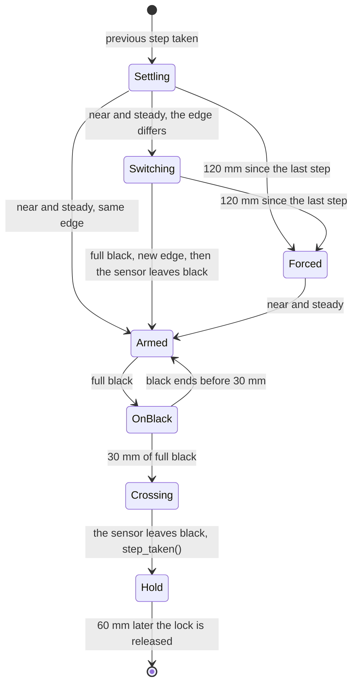

While **Armed**, **OnBlack**, **Crossing** and **Hold**,
[`lock_heading()`](../app/codegen/templates/line_follower.py.j2#L209) sets to
zero any steering that would turn the robot further than LOCK degrees from
the segment heading. Steering back toward it is still allowed.

Code: [`straight_armed()`](../app/codegen/templates/line_follower.py.j2#L199),
[`track_straight()`](../app/codegen/templates/line_follower.py.j2#L233),
lock applied at [`532`](../app/codegen/templates/line_follower.py.j2#L532).

---

## 10. Line search

Started when the line is lost, or after a wall turn that ends on white. All
angles are measured by the gyro. The robot swings forward on the stopped inner
wheel at SRCH deg/s; it never backs up.

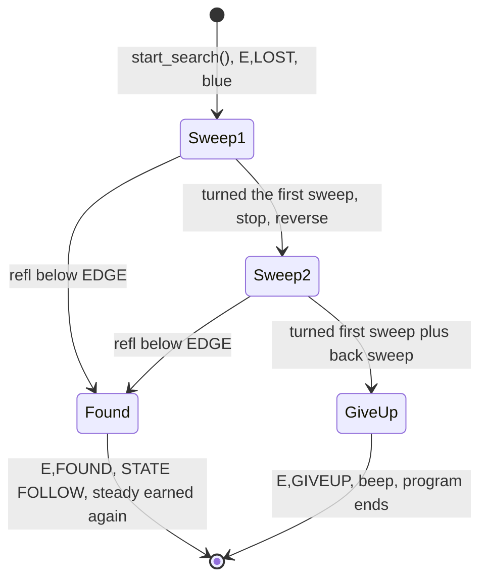

| Started by | First sweep | Direction | Return sweep |
|---|---|---|---|
| Lost line | 45 degrees | `correction_dir(error)`: the usual side of a corner | 45 + 180 degrees the other way |
| Wall turn ending on white | 90 degrees | back toward the old heading | 90 + 45 degrees the other way |

Code: [`start_search()`](../app/codegen/templates/line_follower.py.j2#L387),
[`search_step()`](../app/codegen/templates/line_follower.py.j2#L403).

---

## 11. Wall fallback

If the ultrasonic reads below THR while an L or R step is still pending, the
robot missed the branch and stands in front of the wall.

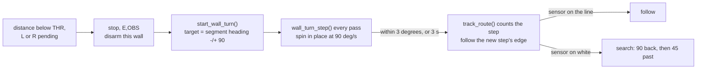

The wall is re-armed only once the distance reads THR or more again, so the
same wall cannot trigger a second turn. With S next, or no route, the robot
only waits (`STATE OBSTACLE`) until the way is clear.

Code: [`start_wall_turn()`](../app/codegen/templates/line_follower.py.j2#L432),
[`wall_turn_step()`](../app/codegen/templates/line_follower.py.j2#L442).

---

## 12. The laptop while the robot drives

All four tasks run on the qasync loop, started in
[`start()`](../app/ui/main_window.py#L566). No threads, and nothing blocks the
Qt thread.

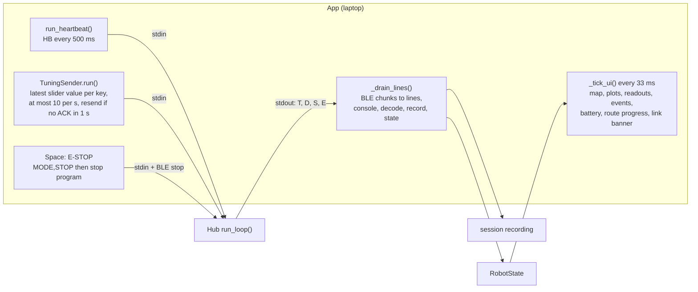

Code: [`run_heartbeat()`](../app/core/connection.py#L128),
[`TuningSender`](../app/core/tuning.py#L36),
[`_drain_lines()`](../app/ui/main_window.py#L1056),
[`_tick_ui()`](../app/ui/main_window.py#L1110).

If the laptop stalls, the robot keeps following the line on its own; the hub
watchdog stops it 2 s after the last command.

---

## 13. Walkthrough: route LRS with KP > 0

KP > 0 means the robot follows the **left** edge by default.

| Phase | Edge | What happens |
|---|---|---|
| Start, step 0 = **L** | left (KP's own) | No switch needed. At the junction the left edge leads into the left branch. At 60 degrees of left turn: `E,TURN 1/3 L`, segment heading +90. |
| Step 1 = **R** | right | After settling (within 30 degrees, steady for 500 ms), PID aims into the tape; on full black the right edge takes over. The right edge leads into the right branch: `E,TURN 2/3 R`. If a wall comes first: turn right on the spot. |
| Step 2 = **S** | left (KP's own) | Settle, switch back to the left edge (or force the lock after 120 mm). The lock arms. 30 mm of full black is the crossing; when the sensor leaves it, `E,TURN 3/3 S`. The lock holds for 60 mm more. |
| After the route | left (KP's own) | Plain line following. With FIN 0 there is no automatic finish: the run ends with Stop, E-STOP, or a search that gives up at the line end. |

---

## 14. Constants

Fixed in [`line_follower.py.j2`](../app/codegen/templates/line_follower.py.j2#L44):

| Constant | Value | Role |
|---|---|---|
| `LOST_MS` / `LOST_MM` | 150 / 30 | full white this long and this far means the line is lost |
| `SEARCH_FIRST_DEG` / `SEARCH_BACK_DEG` | 45 / 180 | search sweeps |
| `TURN_DONE_DEG` | 60 | heading change that counts an L or R step |
| `SETTLE_DEG` | 30 | "near" the segment heading |
| `STEADY_MS` / `STEADY_DEG` | 500 / 5 | steady: net heading change below 5 degrees in 500 ms |
| `ANCHOR_RATE` / `ANCHOR_MAX_DEG` | 0.01 / 15 | heading learning speed and limit |
| `SWITCH_TARGET` | BLACK_BELOW - 2 | PID target while walking into the tape |
| `WALL_TURN_RATE` / `WALL_TOL_DEG` / `WALL_TURN_MS` | 90 / 3 / 3000 | wall turn |
| `WALL_SEARCH_FIRST_DEG` / `WALL_SEARCH_BACK_DEG` | 90 / 45 | search after a wall turn |
| `CROSS_MM` | 30 | full black length that is a crossing |
| `LOCK_AFTER_MM` | 60 | lock held after the crossing |
| `S_FORCE_MM` | 120 | arm the S lock even if the edge switch is not done |
| `INTEGRAL_MAX` | 50 | KI anti-windup cap |
| `GRACE_MS` | 80 | grey time that restarts the adaptive full turn |

Live from the app (sliders, answered with `E,ACK`), declared in
[`_base.py.j2:56`](../app/codegen/templates/_base.py.j2#L56):

| Key | Variable | Role |
|---|---|---|
| `KP` `KI` `KD` | `KP` `KI` `KD` | PID in the grey band; KP sign picks the default edge |
| `SPD` | `BASE_SPEED` | outer wheel speed, mm/s |
| `INNER` `IMIN` `RAMP` | `INNER_PCT` `INNER_MIN_PCT` `INNER_RAMP_MS` | adaptive full turn |
| `SRCH` | `SEARCH_RATE` | search swing rate, deg/s |
| `THR` | `OBSTACLE_MM` | wall distance |
| `FIN` | `FINISH_MM` | finish distance after the last step, 0 = off |
| `LOCK` | `LOCK_DEG` | S heading lock, 5 to 60 degrees |

The route itself is fixed at Run.
